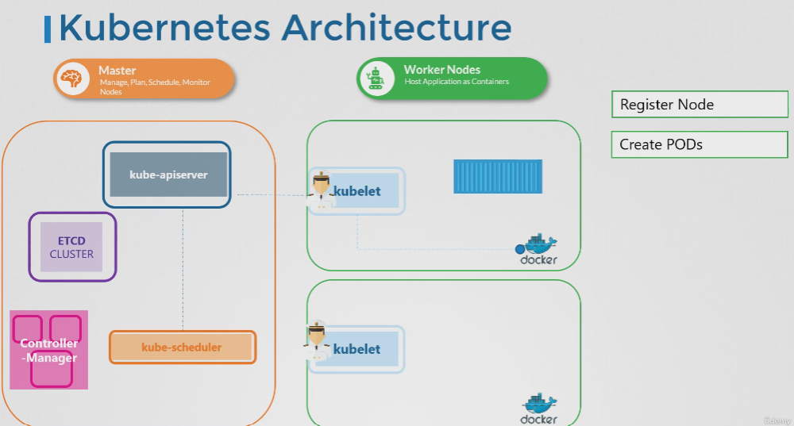

# kubernetes-adminstrator-cka

# ETCD
# Install ETCD

* Default Port of ETCD 2379
- Download Binaries
- Extract
- Run ETCD Service

# Install Kube-api server
- Download Binaries
- Install
- Configure
* kube-api server is the only component that speaks to etcd.

# How to view the kube-api service options in a existing k8s cluster
cat /etc/systemd/system/kube-apiserver.service

or 

ps -aux | grep kube-apiserver

# Install kube-controller-manager
- Downlaod the kube-controller-manager binaries
- Extract
- Run it as a services

# How to view the kube-controller-manager options in a existing 
cat /etc/systemd/system/kube-controller-manager.service

or

ps -aux | grep kube-controller-manager

# Install Kube-scheduler
- Download the kube-scheduler binariy
- Extract it
- Run it as a service ( When you run it as a service you have to specify the kube-scheduler configuration file (kubec-schduler.yml))

ps -aux | grep kube-scheduler

# Install kubelet
- download the installer
- Extract it
- Run it as a service

You can view the kubelet process and effective options using below

ps -aux | grep kubelet

# Install Kube-proxy

- download the installer
- Extract it
- Run it as a service

