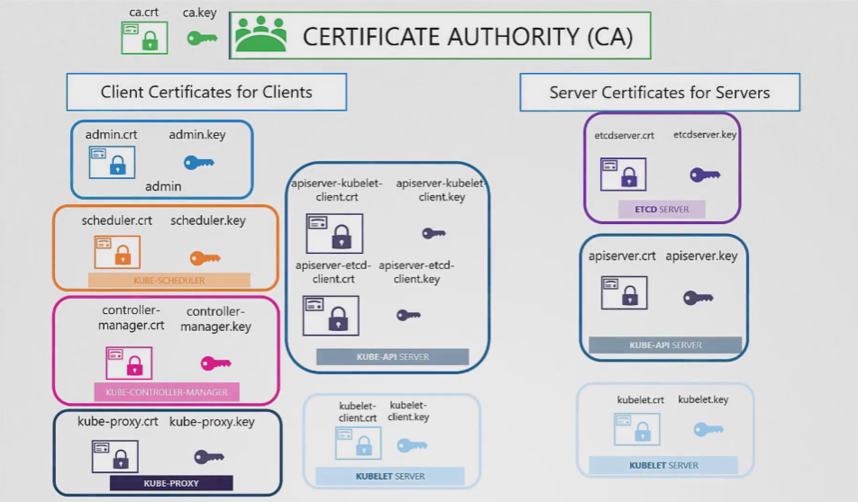

# Generating CA Certs

```
Generate Keys: openssl genrsa -out ca.key 2048
Certificate Signing Request: openssl req -new -key ca.key -subj "/CN=KUBERNETES-CA" -out ca.csr
Sign Certificates: openssl x509 -req -in ca.csr -signkey ca.key -out ca.crt
```

# Generating Client Certificates

# ADMIN USER
```
Generate Keys: openssl genrsa -out admin.key 2048
Certificate Signing Request: openssl req -new -key admin.key -subj "/CN=kube-admin" -out admin.csr
Sign Certificates: openssl x509 -req -in -CA ca.crt -CAkey ca.key -out admin.crt
```

Generate the remaining certs in the similar fashion.


